# PRCC-Nature_Communications
The scripts that support the findings in the PRCC paper published in [Nature Communications](https://www.nature.com/articles/s41467-025-57697-7).

Our results identify the disrupted Hippo/YAP signaling as a major contributor to pRCC and suggest that targeting the
disrupted Hippo pathway represents a novel strategy to prevent and treat pRCC.

# Project Abstract
- Large-scale cancer genetic/genomic studies demonstrated that papillary renal cell carcinoma (pRCC) is
featured with a frequent shallow deletion of the upstream tumor suppressors of the Hippo/YAP
signaling pathway, suggesting that this signaling pathway may play a role in pRCC development.
- We developed a transgenic mouse model with a renal epithelial cell-specific hyperactivation of
YAP1 and found that hyperactivation of YAP1 could induce dedifferentiation and transformation
of renal tubular epithelial cells leading to the development of pRCC. 
- We analyzed at the single cell resolution the cellular landscape alterations during cancer initiation and progression and revealed: 
    - the hyperactivated YAP1, via manipulating multiple signaling pathways, induced epithelial cell transformation, MDSC (Myeloid-derived suppressor cells) accumulation, and pRCC development.
    - depletion of MDSC blocked YAP1-induced kidney overgrowth and tumorigenesis. Inhibiting YAP1 activity with MGH-CP1, a newly developed TEAD inhibitor, blocked MDSC accumulation and suppressed tumor development. 

# Results

  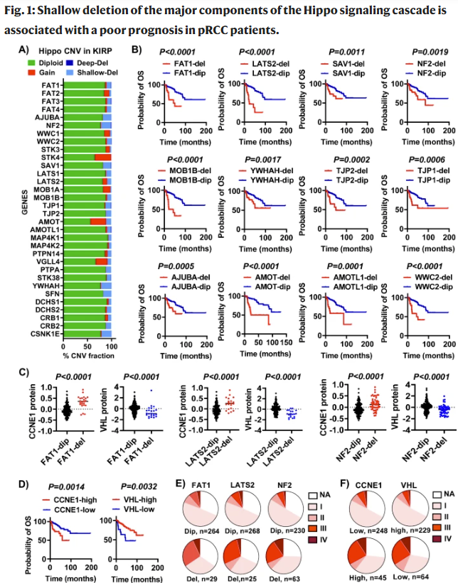
   
  <em></em>

---

  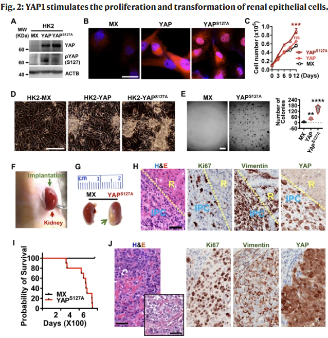
   
  <em></em>

---

  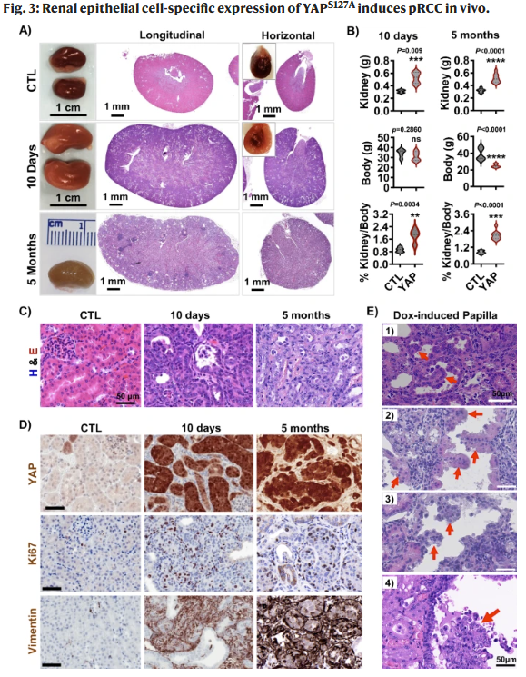
   
  <em></em>

---

  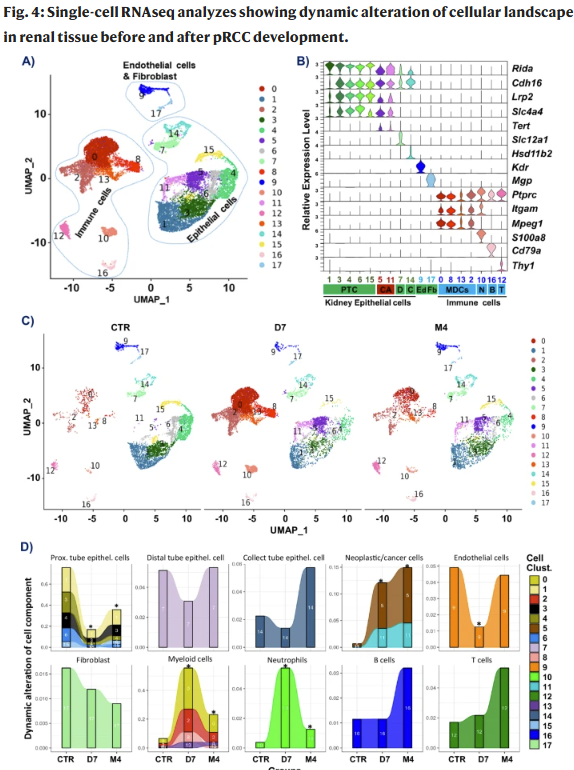
   
  <em></em>

---

  
   
  <em></em>

---

  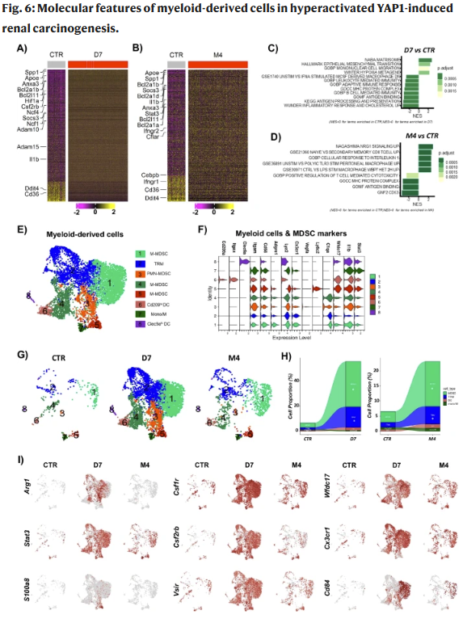
   
  <em></em>

---

  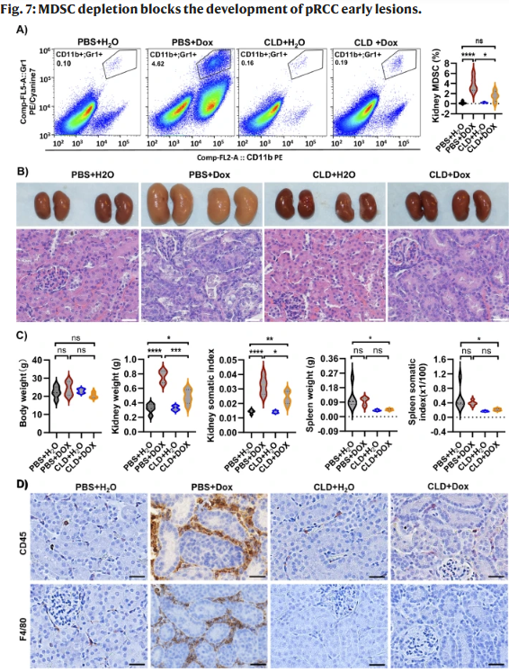
   
  <em></em>

---

  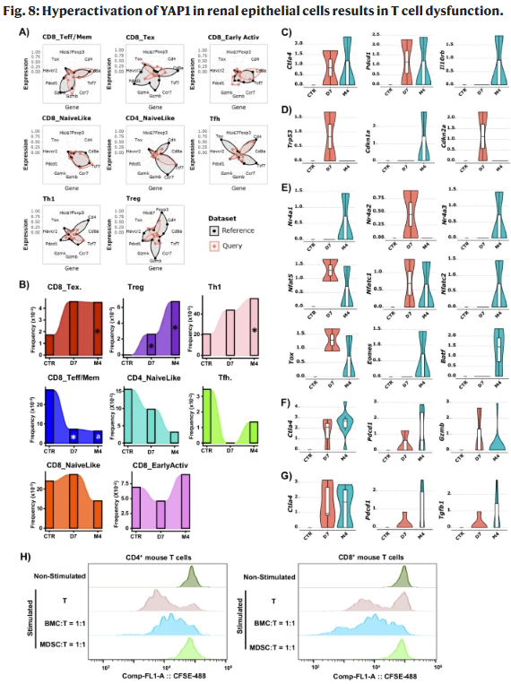
   
  <em></em>

---

  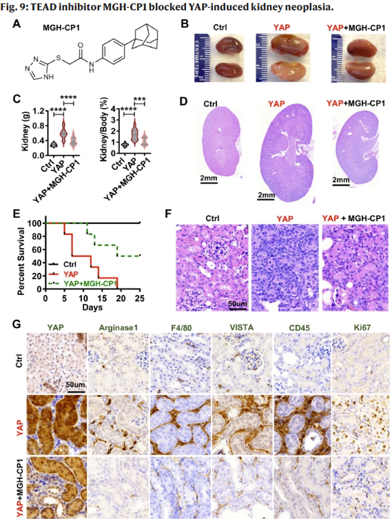
   
  <em></em>

---

  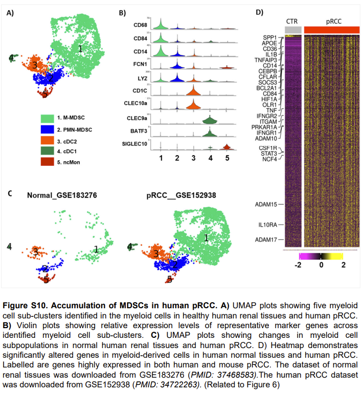
   
  <em></em>

---

  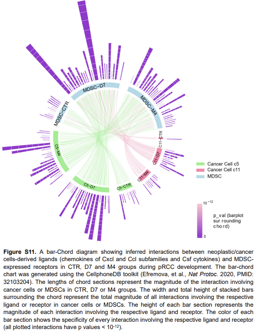
   
  <em></em>

---

  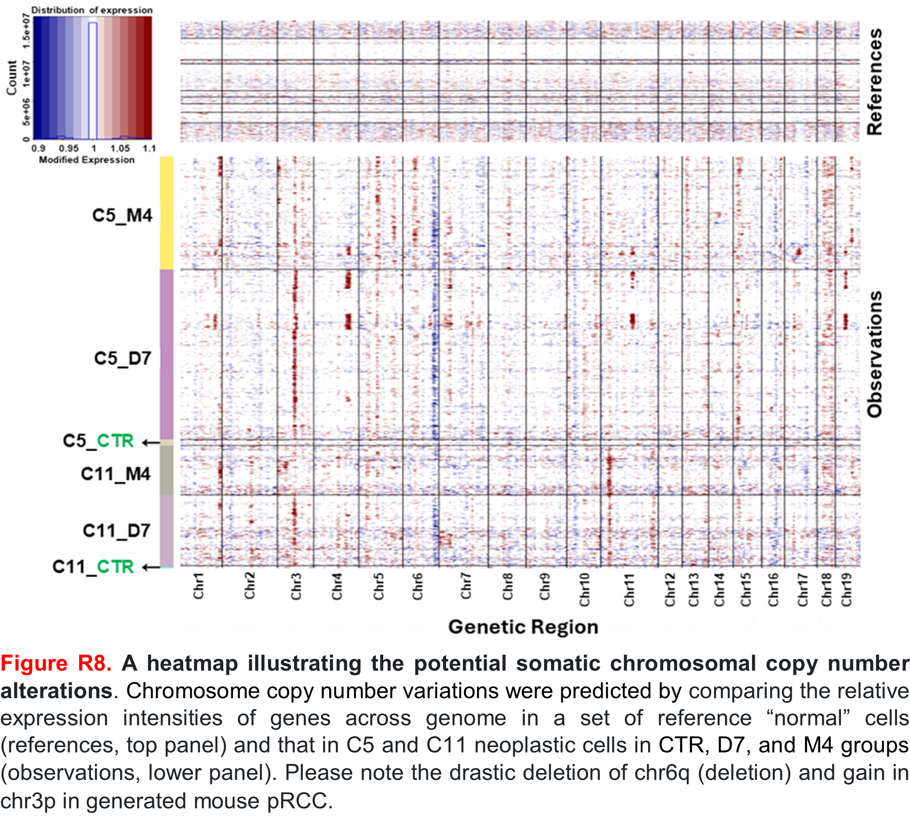
   
  <em></em>

---